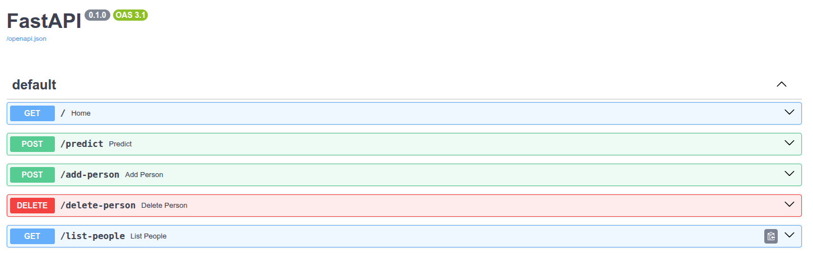
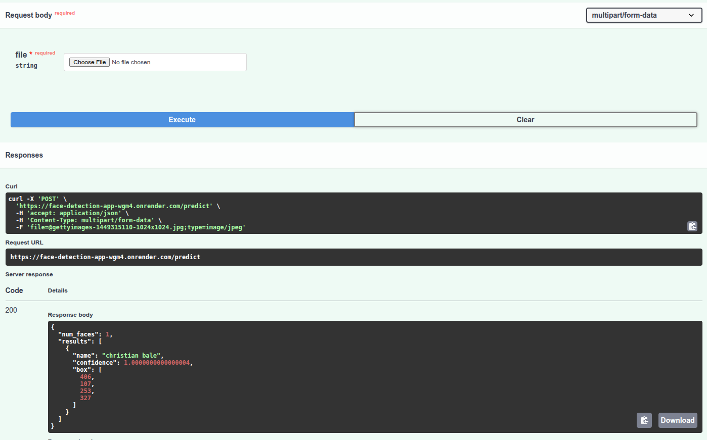
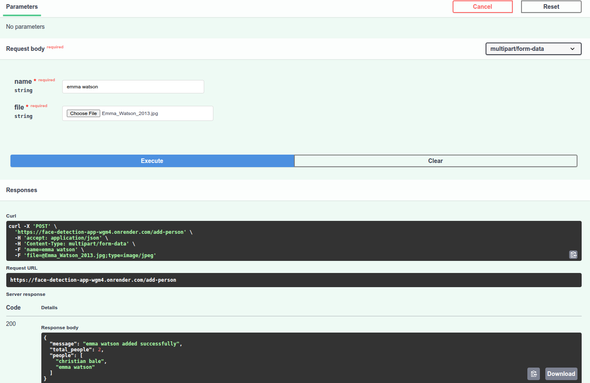
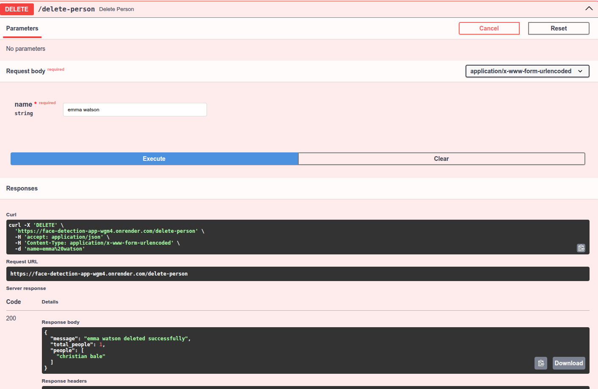
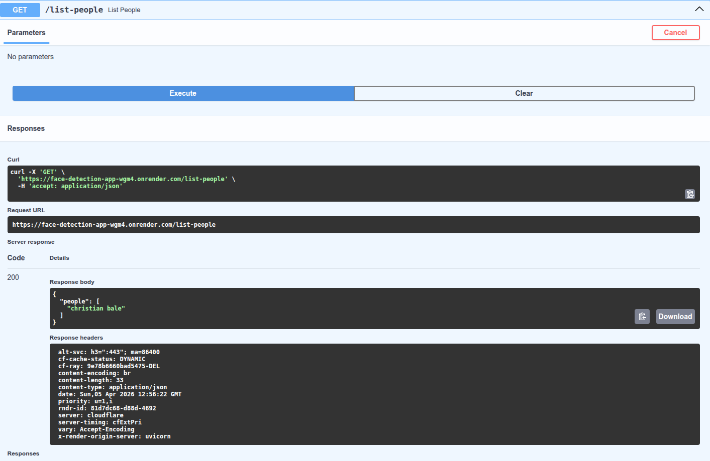

# 🔍 Face Recognition System

### 🚀 End-to-End Deep Learning Project

<p align="center">
  
  
  
  
</p>

<p align="center">
  
  
</p>

---

## 🚀 Live Demo

* 🌐 **Frontend (Streamlit UI)**
  👉 https://face-detection-app-x5aaubnswbi83pbpplxp3v.streamlit.app/

* ⚙️ **Backend API (FastAPI on Render)**
  👉 https://face-detection-app-wgm4.onrender.com/

* 📄 **Swagger Docs**
  👉 https://face-detection-app-wgm4.onrender.com/docs

---
## 🎥 Demo Video

👉 [Watch Full Demo](https://www.youtube.com/watch?v=MllYlmUcvk0)


## 🧠 Project Overview

This project is a **production-ready Face Recognition System** powered by **Deep Learning**.

It uses a pretrained **FaceNet model** to extract facial embeddings and recognize individuals using similarity metrics.

---

## ✨ Features

* 🔍 Face Detection using MTCNN
* 🧠 Face Recognition using FaceNet embeddings
* ⚡ Real-time prediction (local system)
* ➕ Add new person dynamically
* ❌ Delete person from database
* 🌐 REST API using FastAPI
* 🎨 Interactive UI using Streamlit
* ☁️ Cloud Deployment (Render + Streamlit Cloud)

---

## 📸 Screenshots

<p align="center">
  
  
</p>

<p align="center">
  
  
</p>

<p align="center">
  
</p>


## 🏗️ Architecture

```text
User → Streamlit UI → FastAPI Backend → FaceNet Model → Output
```

---

## 🛠️ Tech Stack

| Category            | Technology                |
| ------------------- | ------------------------- |
| 🧠 Deep Learning    | FaceNet (facenet-pytorch) |
| 👁️ Computer Vision | OpenCV                    |
| ⚙️ Backend          | FastAPI                   |
| 🎨 Frontend         | Streamlit                 |
| ☁️ Deployment       | Render + Streamlit Cloud  |
| 🐍 Language         | Python                    |

---

## 📂 Project Structure

```text
FaceDetection/
│
├── api/                # FastAPI backend
│   └── main.py
│
├── webapp/             # Streamlit frontend (local)
│   └── app.py
│
├── face_embeddings.pkl # Stored face embeddings
├── requirements.txt
└── README.md
```

---

## ⚙️ How It Works

1. Face is detected using MTCNN
2. Face is cropped and resized
3. FaceNet generates a 512-dimensional embedding
4. Embedding is compared with stored embeddings
5. Best match is returned using cosine similarity

---

## 📊 Model Details

* **Model**: FaceNet (VGGFace2 pretrained)
* **Embedding Size**: 512
* **Similarity Metric**: Cosine Similarity

---

## 📈 Performance

| Metric    | Score |
| --------- | ----- |
| Accuracy  | 1.0   |
| Precision | 1.0   |
| Recall    | 1.0   |
| F1 Score  | 1.0   |

---

## 🧪 API Endpoints

| Endpoint         | Method | Description                |
| ---------------- | ------ | -------------------------- |
| `/predict`       | POST   | Recognize faces from image |
| `/add-person`    | POST   | Add new person             |
| `/delete-person` | DELETE | Remove person              |
| `/list-people`   | GET    | List all known people      |

---

## 🖥️ Local Setup

### 1️⃣ Clone Repository

```bash
git clone https://github.com/vansh-kumar-007/face-detection-app.git
cd face-detection-app
```

### 2️⃣ Install Dependencies

```bash
pip install -r requirements.txt
```

### 3️⃣ Run Backend

```bash
uvicorn api.main:app --reload
```

### 4️⃣ Run Frontend

```bash
streamlit run webapp/app.py
```

---

## ☁️ Deployment

### 🔹 Backend (Render)

* Deployed using FastAPI
* Handles deep learning inference

### 🔹 Frontend (Streamlit Cloud)

* Lightweight UI
* Communicates with Render API

---

## ⚠️ Notes

* Render free tier may sleep after inactivity
* First API call may take a few seconds
* Deployment uses precomputed embeddings

---

## 🔮 Future Improvements

* 🎥 Real-time webcam deployment online
* 🗄️ Database integration (MongoDB / PostgreSQL)
* 🔐 User authentication
* 📊 Face-based attendance system
* 🎨 Enhanced UI/UX

---

## 👨‍💻 Author

**Vansh Kumar**
B.Tech Civil Engineering, DTU

---

## ⭐ Support

If you like this project, give it a ⭐ on GitHub!
